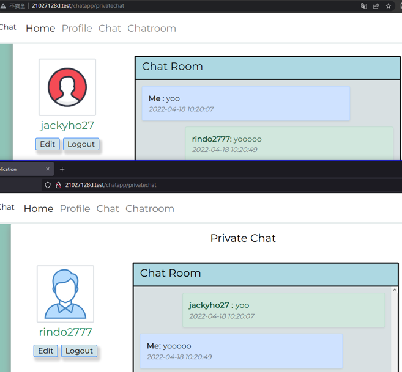
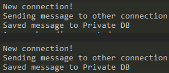

# Year 3 project

EasyChat is a simple real time chat application. It allows users to register, log in and chat with other users. Users can send messages to all users in chatroom page, or 
send messages to specific users.

## Instant Chat

## Start Chat Server

Copy this two command in terminal 
1. `cd chatapp\private\core`
2. `php server.php`
Connection will be initialized 

## Library used:
1. ramsey/uuid: 4.2
2. hackzilla/password-generator: 1.6
3. cboden/ratchet: 0.4

